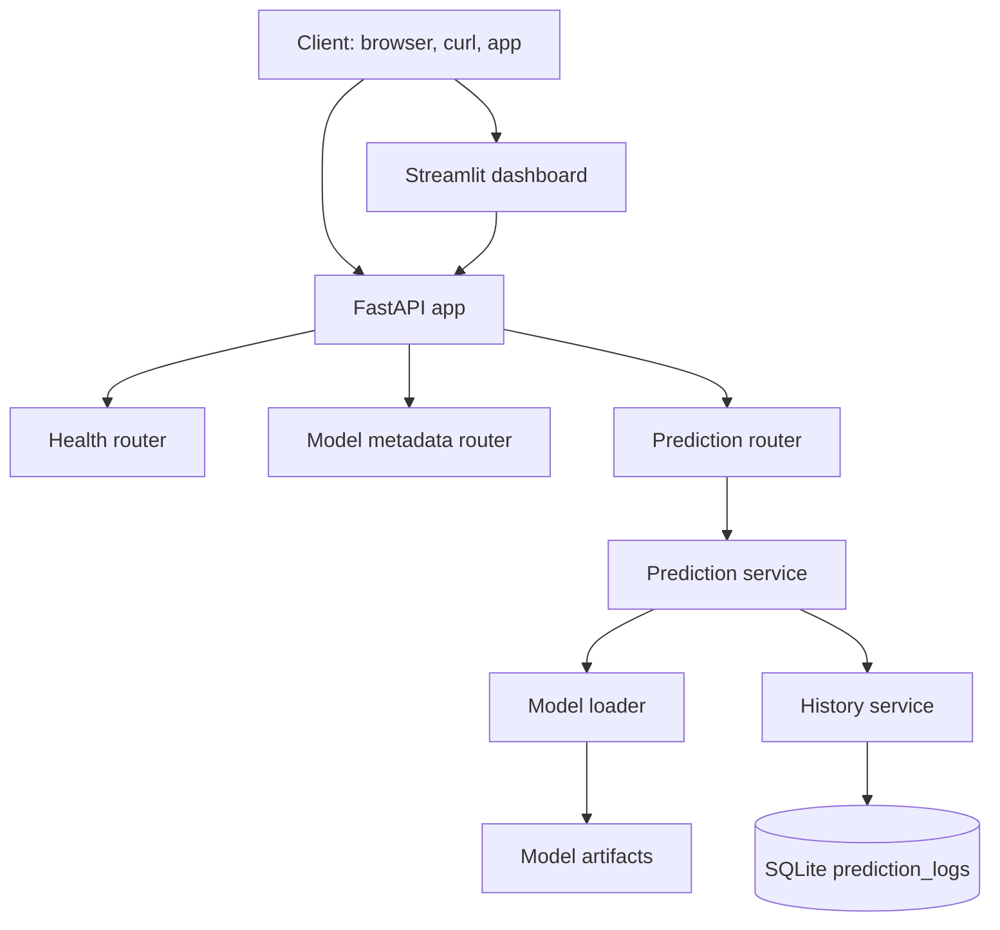
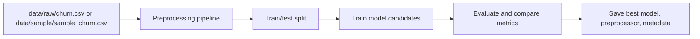

# BankChurnPredict - System Architecture

## Overview

BankChurnPredict uses a layered architecture that separates model training from API serving. Training code writes versioned artifacts to disk. The API loads those artifacts and focuses only on request validation, inference, logging, and response formatting.

## Runtime Architecture

## Training Architecture

## Layers

| Layer | Location | Responsibility |
| --- | --- | --- |
| API | `app/api/` | HTTP routes and response models |
| Dashboard | `dashboard/` | Streamlit demo interface that calls the API |
| Schemas | `app/schemas/` | Pydantic request and response validation |
| Services | `app/services/` | Prediction orchestration, artifact loading, history access |
| Database | `app/db/` | SQLAlchemy engine, session, and prediction log model |
| ML pipeline | `ml/` | Data prep, training, evaluation, inference utilities |
| Artifacts | `models/` | Generated model, preprocessor, and metadata files |

## Request Flow

1. A client sends JSON to `POST /predict`.
2. Pydantic validates the request body against `ChurnPredictionRequest`.
3. `prediction_service.py` converts the payload to a pandas DataFrame.
4. The cached preprocessor transforms the input features.
5. The cached model produces the class prediction and probability.
6. `history_service.py` writes the request and response to SQLite.
7. The API returns a typed JSON response.

The Streamlit dashboard follows the same API flow. It does not load the model
directly; it submits prediction requests to FastAPI and reads model metadata and
prediction history from the existing endpoints.

## Training Flow

1. `ml.train` resolves the dataset path. It prefers `data/raw/churn.csv` and falls back to `data/sample/sample_churn.csv`.
2. `ml.preprocess` drops identifier columns, handles missing values, separates features from the target, and builds the preprocessing pipeline.
3. `ml.model_registry` provides candidate models.
4. `ml.evaluate` calculates accuracy, precision, recall, F1-score, ROC-AUC, and confusion matrix.
5. The best model is selected by ROC-AUC and saved with its fitted preprocessor and metadata.

## Design Decisions

- Training and serving are separate so the API never contains model-fitting logic.
- The model loader caches artifacts to avoid disk reads on every request.
- SQLite is used for simple local development, with database URL configuration ready for extension.
- Pydantic schemas keep API validation explicit and visible in Swagger UI.
- A committed sample dataset keeps CI and clean-clone demos working even when the full raw dataset is absent.
